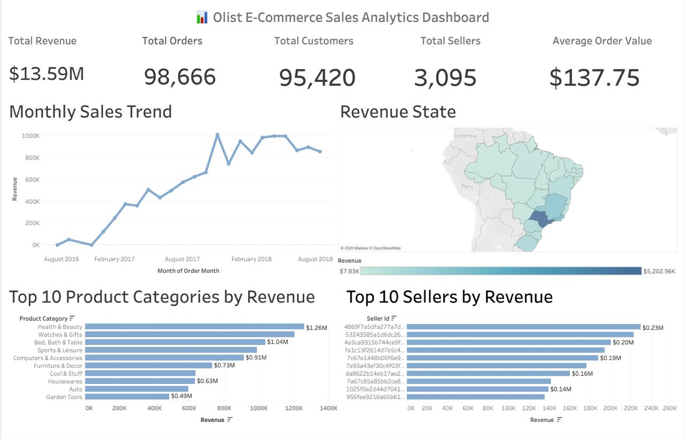
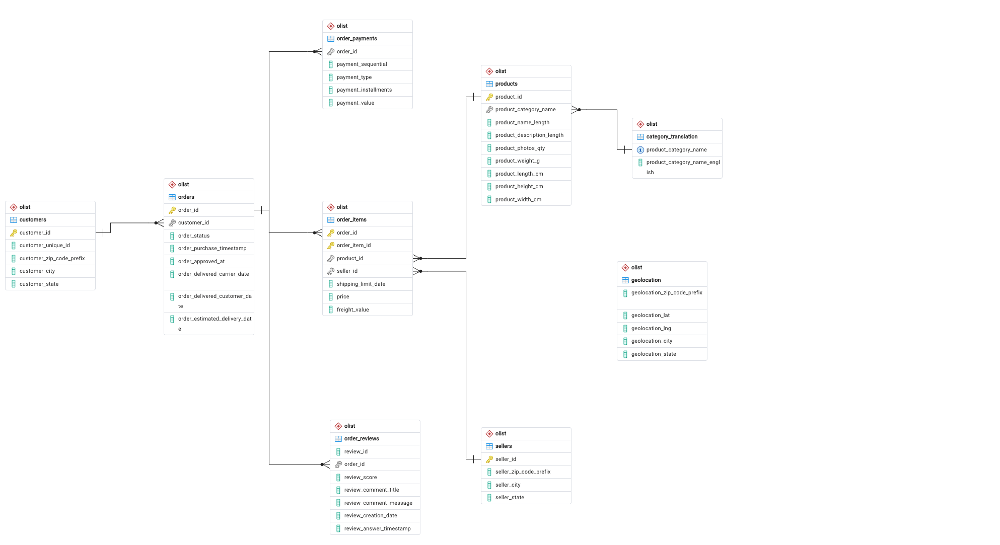

# 📊 Olist Business Analytics Dashboard

> An end-to-end Business Intelligence project built using **PostgreSQL** and **Tableau**, transforming the Brazilian Olist E-Commerce dataset into an interactive executive dashboard with dynamic cross-filtering, KPI reporting, and business insights.


## 📸 Dashboard Preview





# 🚀 Project Overview

This project demonstrates a complete Business Intelligence workflow starting from raw relational data to an interactive executive dashboard.

The solution includes:

- PostgreSQL database design
- Data cleaning and SQL transformations
- Analytical SQL views
- Interactive Tableau dashboard
- Cross-filtering between visualizations
- Executive KPI reporting

The dashboard enables stakeholders to analyze sales performance, customer behavior, product performance, seller performance, and geographic revenue distribution through a single interactive interface.

---

# 📁 Repository Structure

```
olist-business-analytics
│
├── dashboards/
│   ├── Olist_dashboard.twb
│   ├── Olist_dashboard.twbx
│
├── sql/
│   ├── 01_create_tables.sql
│   ├── 02_import_data.sql
│   ├── 03_constraints.sql
│   ├── 04_data_validation.sql
│   ├── 05_analysis_queries.sql
│   ├── 06_tableau_views.sql
│   └── 07_tableau_dashboard_views.sql
│
├── data/
│
├── images/
│   ├── dashboard-overview.png
│   └── ERD.png
│
├── README.md
└── LICENSE
```

---

# 🛠 Tech Stack

| Category | Technologies |
|-----------|--------------|
| Database | PostgreSQL |
| SQL | PostgreSQL SQL |
| Visualization | Tableau Desktop |
| Dashboard | Tableau |
| Version Control | Git & GitHub |

---

# 🗄 Database Schema

The project is built on the Brazilian Olist E-Commerce dataset consisting of multiple normalized tables.

Main tables include:

- Customers
- Orders
- Order Items
- Products
- Sellers
- Payments
- Reviews
- Category Translation

---

## Entity Relationship Diagram




---

# 📊 Dashboard Features

## Executive KPIs

- Total Revenue
- Total Orders
- Total Customers
- Total Sellers
- Average Order Value

---

## Interactive Visualizations

### Monthly Revenue Trend

Analyze revenue growth over time.

---

### Revenue by State

Interactive choropleth map showing revenue distribution across Brazilian states.

---

### Top 10 Product Categories

Identify highest revenue generating categories.

---

### Top 10 Sellers

Discover top performing sellers.

---

# ✨ Interactive Features

The dashboard supports:

- Dynamic cross-filtering
- Interactive map selection
- Product category filtering
- Seller filtering
- Monthly trend filtering
- Responsive KPI updates
- Rich tooltips
- Automatic dashboard interactions

---

# 📈 Key Business Insights

The dashboard helps answer questions such as:

- Which states generate the highest revenue?
- Which product categories drive sales?
- Who are the highest-performing sellers?
- How has revenue changed over time?
- What is the average order value?
- Which customer regions contribute the most revenue?

---

# 📂 SQL Components

The project includes SQL scripts covering:

- Database creation
- Table relationships
- Foreign keys
- Data validation
- Business analysis queries
- Tableau reporting views
- Interactive dashboard views

---

# 🎯 Tableau Dashboard Design

The dashboard follows executive dashboard best practices:

- Clean layout
- Minimal color palette
- Executive KPI cards
- Interactive visualizations
- Cross-filtering
- Consistent formatting
- Business-friendly design

---

# 📌 Future Improvements

- Deploy dashboard using Streamlit
- Add predictive sales forecasting
- Customer segmentation analysis
- Profitability dashboard
- Seller performance scorecards
- Customer lifetime value analysis

---

# ▶️ Getting Started

## Clone Repository

```bash
git clone https://github.com/PavanBathula0111/olist-business-analytics.git
```

---

## Database

Import the Olist dataset into PostgreSQL.

Execute the SQL scripts inside the `sql/` directory in numerical order.

---

# 👨‍💻 Author

**Pavan Kumar Bathula**

- GitHub: https://github.com/PavanBathula0111
- LinkedIn: https://www.linkedin.com/in/bathula-pavan/
---

# ⭐ If you found this project useful, consider giving it a star!
